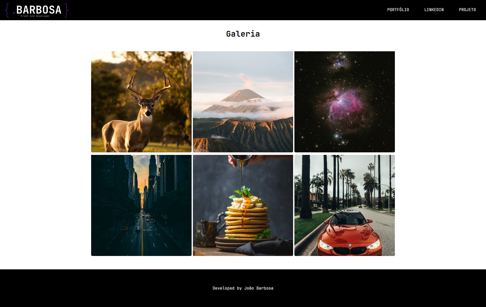

# Lightbox

O Lightbox é um projeto simples de galeria de imagens com a funcionalidade de lightbox. Ele permite que os usuários visualizem imagens em tamanho ampliado, com uma interface agradável e responsiva.

## Demonstração

Veja o Lightbox em ação [aqui](https://joaosbarbosa.github.io/lightbox/).

## Tecnologias Utilizadas

- HTML5
- CSS3
- JavaScript

## Funcionalidades

- Exibição de imagens em uma galeria
- Lightbox para visualização ampliada das imagens
- Navegação entre categorias de imagens clicando sobre elas
- Fechamento do lightbox ao clicar fora da imagem
- Layout responsivo para dispositivos móveis

## Como Usar

1. Clone o repositório: `git clone https://github.com/JoaoSBarbosa/lightbox.git`
2. Entre na pasta do projeto: `cd lightbox`
3. Abra o arquivo `index.html` no seu navegador.

## Contribuição

Contribuições são bem-vindas! Se você tiver sugestões de melhorias, novas funcionalidades ou correções de bugs, sinta-se à vontade para abrir uma issue ou enviar um pull request.

